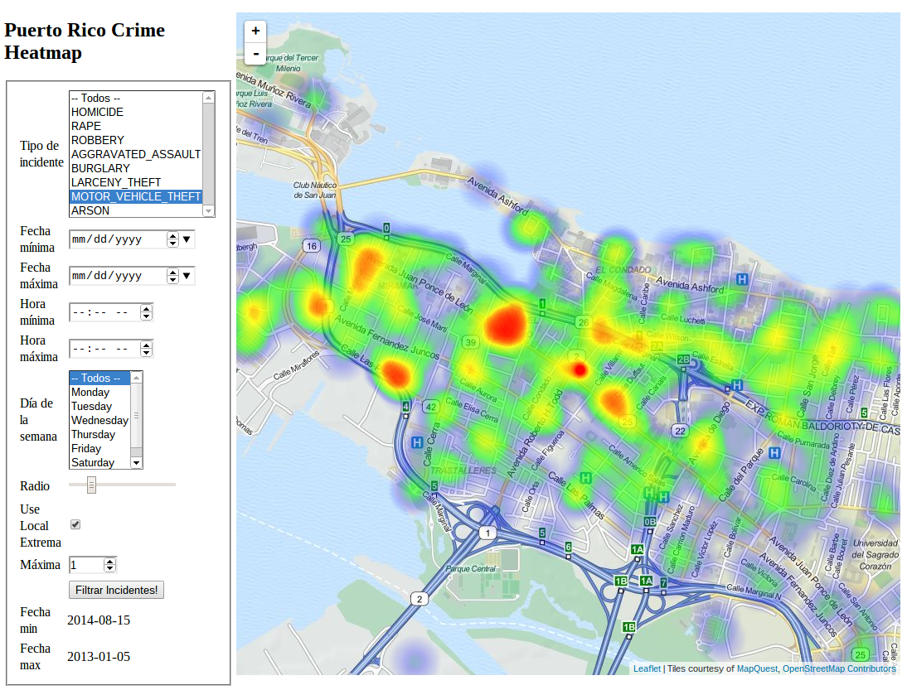

prcrime-heatmap
===============

Puerto Rico Crime Heatmap

Vease [Demo](http://23.239.18.72:8080/)

Depende de PostGIS. Vease [Esquema](src/sql/create-schema.sql)

Automáticamente carga los datos de [https://data.pr.gov/resource/incidencia-crime-map.json](https://data.pr.gov/resource/incidencia-crime-map.json)
por medio de polling cada hora.

Como compilar y empacar el war
------------------------------

El proyecto esta hecho en Groovy y depende de Java 8. El backend depende de librerias de Maven Central.
El GUI utiliza librerias de javascript que se deben descargar con bower.
Para compilar, ejecute:

`sudo npm -g install bower && bower install && ./gradlew build`

